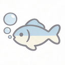

  

<h1 align="center">BabelFish</h1>

  Desktop PDF translation app

  
  
  

BabelFish is a simple desktop app for translating PDF files.

It uses `BabelDOC` as the translation engine and provides a lightweight GUI for queueing files, checking progress, and viewing history.

## Engine

- Core engine: `BabelDOC`
- App type: desktop GUI for PDF translation

## License

- This project is licensed under `GNU AGPL v3.0`
- BabelDOC is also licensed under `AGPL-3.0`
